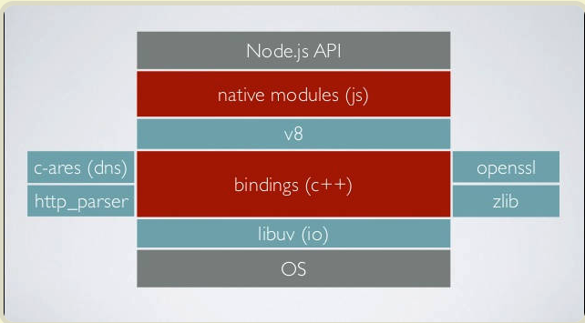
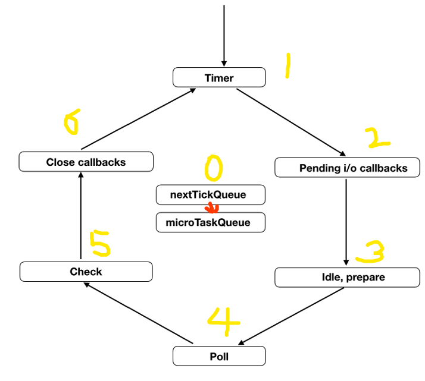
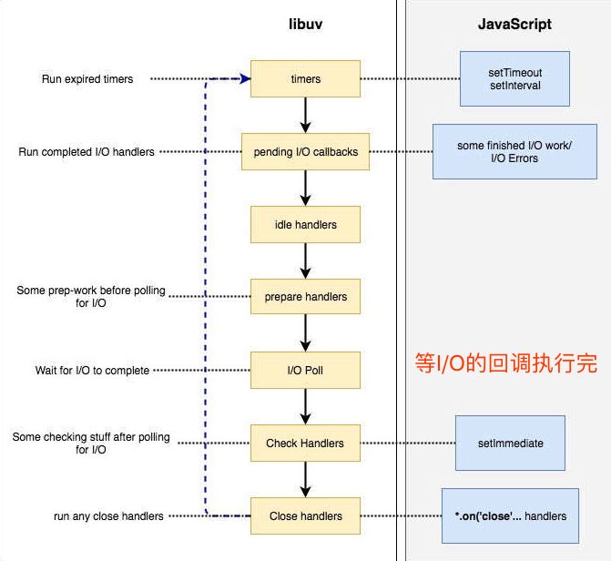

# Node.js 定时器
> [参考文章](http://www.ruanyifeng.com/blog/2018/02/node-event-loop.html)

## 背景
---
JS 是单线程运行，异步操作很重要。
* 只要是用到 引擎 之外的东西，就需要和外部进行交互，从而形成异步操作。
* 一个人受打击多了，他的抗打击能力必须变得很强，否则就完蛋。所以，JS提供了很多异步语法。

For Node.js
* Node 的异步语法比浏览器更复杂，因为他除了和外部交互，还需要和内核对话，于是，他不得不搞出一个`libuv`库。
  * 这个库负责各种回调函数的执行时间，就是帮你排好每一个任务几时跑。
    <u>**毕竟，异步任务最终还是需要回到主线程，一个个排队执行。**</u>

* 在Node.js，我们有四个定时器：
  1. `setTimeout()` [JS]
  2. `setInterval()` [JS]
  3. `setImmediate()` [Node]
  4. `process.nextTick()` [Node]

## 具体实例
---
代码：
```js
setTimeout(() => console.log(1));
setImmediate(()=> console.log(2));
process.nextTick(()=>console.log(3));
Promise.resolve().then(()=>console.log(4));
(()=>console.log(5))();
```
执行结果：
```
5
3
4
1
2
```
解释：
* 同步方法 < 异步方法
* 本轮循环的异步任务 < 次轮循环的异步任务
  * Node规定: `process.nextTick()`和`Promise`的回调函数，都追加到本轮循环中执行
  * Node规定: `setTimeout()`、`setInterval()`、`setImmediate()`，则放到下一轮循环。
* nextTickQueue【最快执行的异步任务队列】
  * 而`process.nextTick()`又是异步任务中最快执行的，因为有个`nextTickQueue`这个队列，每次执行完所有同步任务，就会扫描这个队列。
* 微任务队列【紧接着nextTickQueue 被扫描】
  * so,`Promise`的各种回调函数，会按顺序，进入微任务队列中，等着被扫描。

## 浅析整个Node.js 的事件轮询机制


**首先需要知道，整个Node和JS是一样的，只有一个主线程，不存在什么单独的事件循环线程。So，事件循环是在主线程上完成的。**

### step1: 事件循环开始之前
1. 同步任务
2. 发出异步请求
3. 规划定时器生效的时间
4. 执行`process.nextTick()`等

### step2: 事件循环过程
**整体图解**


**6个阶段**
1. [Queue 1] timers 【定时器阶段】
  * 扫描前提：当前时间 满足 定时器条件
  * 处理`setTimeout()`
  * 处理`setInterval()`
2. [Queue 2] I/O callbacks
  * 调用所有其他回调函数（除了：`setTimeout()`,`setInterval()`,`setImmediate()`和用于关闭请求的回调函数如`socket.on('close',...)`）
3. [Queue 3] idle, prepare
  * 只供`libuv`内部调用，可忽略
4. [Queue 4] poll
  * 这个阶段是轮询时间，用于等待还未返回的 I/O 事件，比如服务器的回应、用户移动鼠标等等。
  * 这个阶段的时间会比较长。如果没有其他异步任务要处理（比如到期的定时器），会一直停留在这个阶段，等待 I/O 请求返回结果。
5. [Queue 5] check
  * 执行`setImmediate()`的回调函数 
6. [Queue 6] close callbacks
  * 该阶段执行关闭请求的回调函数，比如`socket.on('close', ...)`



**特点**

每一个阶段都是一个Queue，只有一个阶段的回调函数队列清空了，该执行的回调函数也都执行完毕了，事件循环才会走到下一个Queue。